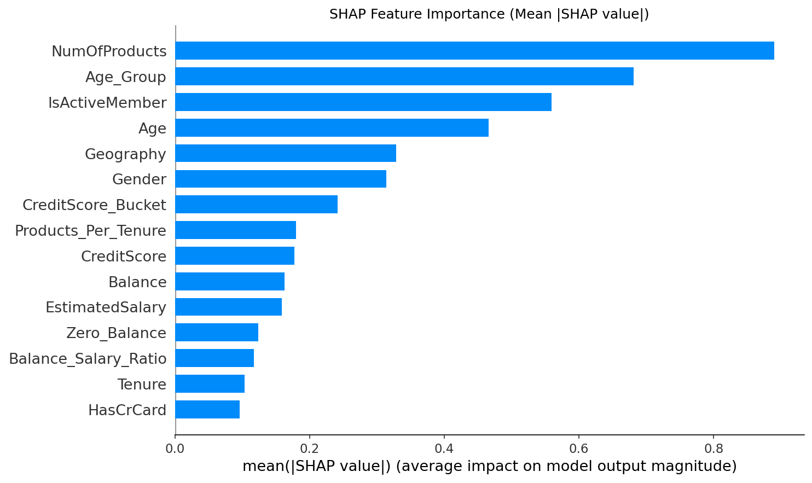
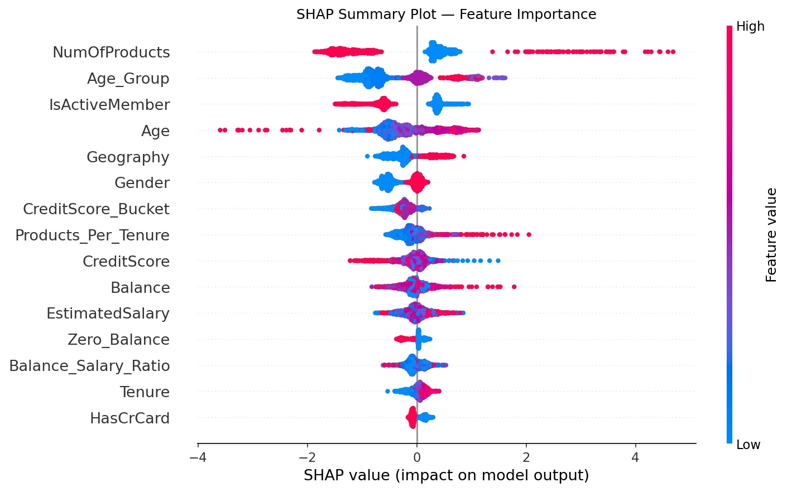
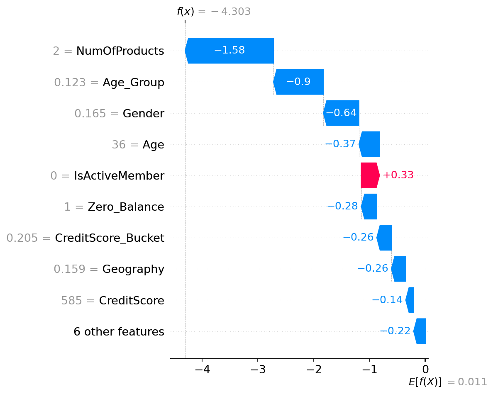

# 🏦 Bank Customer Churn Prediction

Predicting which customers are likely to leave a European bank using machine learning, with explainable AI (SHAP) to understand *why* a customer churns.

---

## 📌 Problem Statement

Customer churn is one of the most costly problems in banking. Acquiring a new customer costs 5–7× more than retaining an existing one. This project builds a classification model to identify at-risk customers **before** they leave, giving the bank time to intervene.

---

## 📊 Dataset

- **Source:** [Kaggle – Bank Customer Churn Dataset](https://www.kaggle.com/datasets/shubhammeshram579/bank-customer-churn-prediction)
- **Size:** 10,000 customers, 14 features
- **Target:** `Exited` (1 = churned, 0 = stayed)
- **Class distribution:** ~20% churned (imbalanced)

| Feature | Description |
| CreditScore | Customer's credit score |
| Geography | Country (France, Germany, Spain) |
| Gender | Male / Female |
| Age | Customer's age |
| Tenure | Years with the bank |
| Balance | Account balance |
| NumOfProducts | Number of bank products used |
| HasCrCard | Has a credit card? |
| IsActiveMember | Active in last period? |
| EstimatedSalary | Annual salary estimate |

---

## 🔍 Exploratory Data Analysis

Key findings from EDA:

- **Age** is the strongest demographic predictor — older customers churn significantly more
- **Germany** has nearly 2× the churn rate of France and Spain
- Customers with **only 1 product** and a **high balance** are disproportionately at risk
- **Inactive members** churn at roughly twice the rate of active ones

---

## 🤖 Model

### Algorithm: CatBoost Classifier

CatBoost was chosen because:
- Handles categorical features (Geography, Gender) natively — no manual encoding needed
- Robust to overfitting on small-to-medium datasets
- Strong out-of-the-box performance with minimal hyperparameter tuning

### Training Setup

- **Split:** 80% train / 20% test (stratified)
- **Threshold tuning:** Default 0.5 threshold adjusted to optimize F1 score on the minority class

---

## 📈 Results

Metric                 Default (0.50)     Tuned (0.35)
------------------------------------------------------
Accuracy                       0.8615           0.8455
Precision                      0.6958           0.6104
Recall                         0.5676           0.6658
F1 Score                       0.6252           0.6369
ROC AUC                        0.8629           0.8629

---

## 🔎 Explainability with SHAP

To make predictions trustworthy and actionable, SHAP (SHapley Additive exPlanations) was used to explain both global feature importance and individual customer predictions.

**Global Feature Importance** — which features matter most across all predictions:




**Per-Customer Explanation** — why this specific customer is predicted to churn:



---

## 🗂️ Project Structure

```
Bank-Customer-Churn/
│
├── Bank_Churn.csv               # Raw dataset
├── Bank_churn_analysis.ipynb    # Main analysis notebook
│
├── eda_plots.png                # Exploratory data analysis visuals
├── correlation_matrix.png       # Feature correlation heatmap
├── confusion_matrix.png         # Model evaluation
├── roc_curve.png                # ROC-AUC curve
├── threshold_tuning.png         # Precision-recall vs threshold
├── shap_importance.png          # Global SHAP feature importance
├── shap_summary.png             # SHAP beeswarm summary
├── shap_waterfall_customer0.png # Per-customer SHAP explanation
│
└── README.md
```

---

## ⚙️ How to Run

**1. Clone the repository**
```bash
git clone https://github.com/Prasmitprayansu/Bank-Customer-Churn.git
cd Bank-Customer-Churn
```

**2. Install dependencies**
```bash
pip install pandas numpy matplotlib seaborn scikit-learn catboost shap
```

**3. Open the notebook**
```bash
jupyter notebook Bank_churn_analysis.ipynb
```

Run all cells from top to bottom. All plots will be saved automatically.

---

## 🛠️ Tech Stack


---

## 🔭 Future Work

- [ ] Add SMOTE / class weighting to better handle class imbalance
- [ ] Compare CatBoost against XGBoost, Random Forest, and Logistic Regression
- [ ] Build a Streamlit dashboard for interactive churn prediction
- [ ] Deploy as a REST API using FastAPI

---

## 👤 Author

**Prasmit Prayansu**  
B.Tech Computer Science  
[GitHub](https://github.com/Prasmitprayansu)
